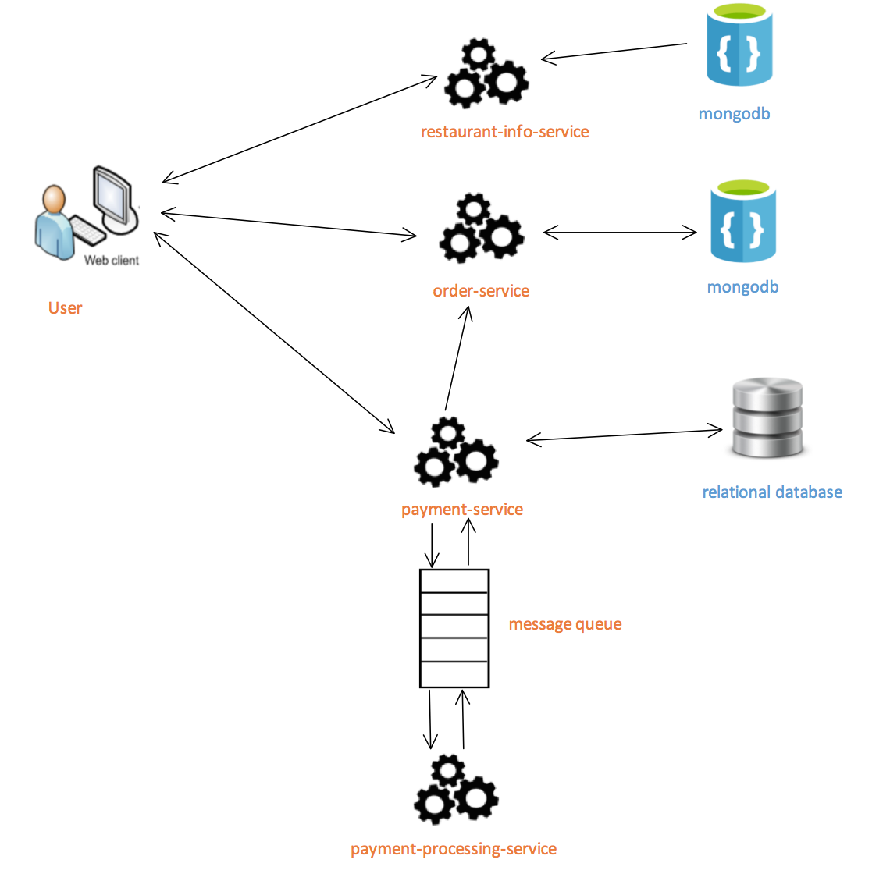

# Food-Delivery-System

Food Delivery Application based on microservices architecture.

## Table of Contents

- [Installation](#installation)
- [Requirements](#requirements)
- [System Architecture](#system-architecture)
- [Functionality](#functionality)
- [Project Managment](#project-managment)
- [Contributing](#contributing)

## Installation

1. Run `docker-compose up -d` to start MongoDB and Rabbitmq if you don't have them on your local computer.
2. Build  with (`mvn clean install -U`) then start services:  
restaurant-info-service --> order-service --> payment-service --> payment-processing-service.
3. Upload restaurant test data in `restaurant.json`.
4. Open restaurant UI on http://localhost:8080

## Requirements

- Java JDK 8
- Apache Maven
- Docker
- MongoDB
- H2 Databse
- Lombok Intellij Plugin
- HOTSWAP AGENT Intellij Plugin
- DCEVM Plugin for JAVA HotSwap functionality in OS [DCEVM](http://dcevm.github.io/)

## System Architecture

> Detailed information about each service can be found in service folder.

## Functionality

**Done**
- Search restaurant by name.
- Get restaurant info.
- Place order, get order details.
- Make payment.
- Handle payment errors, such as payment authorization timeout and invalid credit card info.
> Currently it is assumed that all users are anonymous (not registered) and shopping cart is managed at the front end.
Once we have the account-service in the future, the shopping cart service can be implemented at the back end.

**TO DO**
- [ ] Take delivery distance, restaurant hours into consideration.
- [ ] Add account-service to manage user registration and login.
- [ ] Finish Spring Cloud platform.
- [ ] Test system performance of handling high volume of requests.

## Project Managment

Please go to this youTrack link [YouTrack](https://wolverinesolutions.myjetbrains.com).

## Contributing

Please contribute using [Github Flow](https://guides.github.com/introduction/flow/). Create a branch, add commits, and [open a pull request](https://github.com/hitman3r44/food-delivery-backend/compare/).
